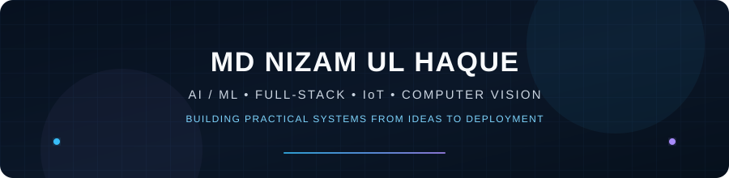
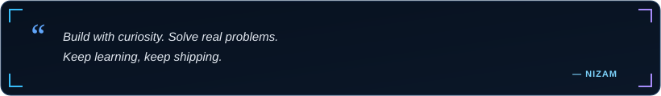

  

  

  
  &nbsp;
  
  &nbsp;
 

  

---

<h2 align="center">✨ About Me</h2>

  

  I'm <b>MD Nizam Ul Haque</b>, a Computer Science with IoT graduate from
  <b>Madhav Institute of Technology and Science, Gwalior</b>.
    
  I enjoy building <b>full-stack applications, backend systems, AI/ML solutions
  and computer vision projects</b> that solve practical problems.

  
  &nbsp;
  
  &nbsp;
  

  💡 <b>Interests:</b> AI/ML • Backend Engineering • Full-Stack Development • Computer Vision • IoT
   
  ⚡ <b>Currently building:</b> Java, Spring Boot, React & AI-powered applications

<table width="100%" border="0" align="center">
<tr>

<td width="50%" align="center" style="padding: 16px;">
  <h4>🔐 Featured Project</h4>
  

    <b>AuthenticAI</b> 
    AI-Powered Product Authentication
  

</td>

<td width="50%" align="center" style="padding: 16px;">
  <h4>💻 Development Focus</h4>
  

    <b>Java & Spring Boot</b> 
    Full-Stack & Backend Engineering
  

</td>

</tr>

<tr>

<td width="50%" align="center" style="padding: 16px;">
  <h4>🔬 Research</h4>
  

    <b>AI & Computer Vision</b> 
    IEEE Conference Publication
  

</td>

<td width="50%" align="center" style="padding: 16px;">
  <h4>🧩 Problem Solving</h4>
  

    <b>500+ DSA Problems</b> 
    LeetCode & GeeksforGeeks
  

</td>

</tr>
</table>

---

<h2 align="center">🚀 Featured Project</h2>

<table width="100%" border="0" align="center">
<tr>
<td align="center" style="padding: 24px;">

<h3>🔐 AuthenticAI — AI-Powered Product Authentication</h3>

<i>
A full-stack product authentication platform combining computer vision,
zero-shot validation and deep-learning based authenticity classification.
</i>

<b>Pipeline:</b> CLIP Zero-Shot Validation → MobileNetV2 Authenticity Classification

<b>Stack:</b> Python • Flask • TensorFlow • PyTorch • CLIP • MobileNetV2 • React.js • Docker

 

</td>
</tr>
</table>

---

<h2 align="center">🧩 Featured Projects</h2>

<table width="100%" border="0" align="center">

<tr>

<td width="50%" align="center" style="padding: 20px;">

<h3>🏢 Multi-Tenant SaaS Dashboard</h3>

A SaaS management platform supporting multiple organizations with isolated
data access, JWT authentication and hierarchical role management.

React.js • Spring Boot • MongoDB • Spring Security • JWT • REST APIs

</td>

<td width="50%" align="center" style="padding: 20px;">

<h3>🔐 AuthenticAI</h3>

AI-powered product authentication using a two-stage computer vision pipeline
with CLIP zero-shot validation and a MobileNetV2 authenticity classifier.

Python • Flask • PyTorch • TensorFlow • React.js • Docker

</td>

</tr>

<tr>

<td width="50%" align="center" style="padding: 20px;">

<h3>🛒 E-Commerce Platform</h3>

Scalable e-commerce platform with buyer and seller portals, inventory,
order tracking, payment processing and role-based access control.

React.js • Spring Boot • MySQL • JWT • RBAC • Razorpay

</td>

<td width="50%" align="center" style="padding: 20px;">

<h3>🗳️ AI E-Voting Research</h3>

Research project focused on an Aadhaar-based electronic voting system
integrating facial recognition for enhanced security and accessibility.

IEEE SCEECS 2025 • Facial Recognition • AI • Security

</td>

</tr>

</table>

---

<h2 align="center">🛠️ Tech Stack</h2>

  <b>Languages</b>

  

  <b>Frontend & Backend</b>

  

  <b>Databases & Development Tools</b>

  

  <b>AI / ML & Computer Vision</b>

  

  
  &nbsp;
  
  &nbsp;
  
  &nbsp;
  
  &nbsp;
  

---

<h2 align="center">💼 Experience</h2>

<table width="100%" border="0" align="center">

<tr>
<td align="center" style="padding: 20px;">

<h3>🔬 Research Intern — 5G Lab, IIIT Delhi</h3>

<b>Jun – Jul 2025 · New Delhi, India</b>

Engineered a real-time distributed monitoring system integrating
<b>Computer Vision, IoT sensors and backend APIs</b> over a private 5G network.
Designed scalable backend modules for real-time event processing and
low-latency alert generation.

Computer Vision • IoT • Backend APIs • Private 5G • Git • Integration Testing

</td>
</tr>

<tr>
<td align="center" style="padding: 20px;">

<h3>💻 Web Developer Intern — Threat Expert Cyber Solution</h3>

<b>Apr – May 2025 · Remote</b>

Developed scalable <b>RESTful backend services using Java Spring Boot</b>,
built secure APIs consumed by React applications and worked across
debugging, testing, code reviews and Agile development cycles.

Java • Spring Boot • REST APIs • React • OOP • Agile • Testing

</td>
</tr>

</table>

---

<h2 align="center">🔬 Research & Publications</h2>

<table width="100%" border="0" align="center">

<tr>
<td align="center" style="padding: 20px;">

<h3>🗳️ Aadhaar-Based E-Voting System with Facial Recognition</h3>

<b>IEEE International Students' Conference — SCEECS 2025</b>

"Design and Implementation of an Aadhaar-Based E-Voting System with
Facial Recognition for Enhanced Security and Accessibility."

IEEE SCEECS 2025 · DOI: 10.1109/SCEECS64059.2025.10940330

</td>
</tr>

<tr>
<td align="center" style="padding: 20px;">

<h3>⚡ AI-Powered Smart Grid Fault Detection & Predictive Maintenance</h3>

Research work presented/submitted under <b>ICSPER 2025</b>, focused on
AI-based smart grid fault detection and predictive maintenance.

</td>
</tr>

</table>

---

<h2 align="center">🏆 Achievements & Certifications</h2>

 

 

  🏅 <b>Meritocracy Award</b> — MITS Gwalior for academic and project excellence
   
  ☁️ <b>NPTEL Elite</b> — Cloud, IoT Edge ML
   
  ☕ <b>HackerRank Java (Basic)</b> — Skills Certification
   
  📊 <b>Data Visualization</b> — Forage

---

<h2 align="center">📈 Problem Solving</h2>

  <i>500+ Data Structures & Algorithms problems solved across LeetCode and GeeksforGeeks.</i>

  
  
  
  
  
  

---

<h2 align="center">📊 GitHub Analytics</h2>

  
  &nbsp;&nbsp;
  

  

---

<h2 align="center">⚡ Contribution Journey</h2>

  

---

  

---

<h2 align="center">📬 Let's Connect</h2>

  <i>
    Interested in AI/ML, backend engineering, full-stack development,
    computer vision or IoT? Let's connect and build something useful.
  </i>

<table border="0" align="center">

<tr>

<td align="center" width="220" style="padding: 16px;">
  <a href="mailto:mdnizamhaque13@gmail.com">
    
      
    
  </a>
   
  <b>Direct Contact</b>
</td>

<td align="center" width="220" style="padding: 16px;">
  <a href="https://github.com/NizamHaque">
    
      
    
  </a>
   
  <b>Projects & Code</b>
</td>

<td align="center" width="220" style="padding: 16px;">
 <a href="https://www.linkedin.com/in/nizam-haque-dev77/" target="_blank">
  
    
  
</a>
   
  <b>Professional Network</b>
</td>

</tr>

</table>

  

  Building • Learning • Solving • Deploying

